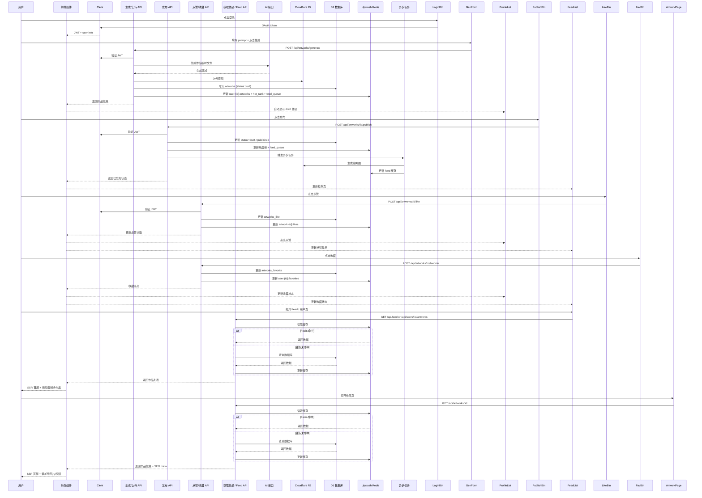

AI社区全流程架构蓝图

---

## **完整开发蓝图内容**

> 当前实现进度（基于本仓库现状）
> - 前端页面/组件：已完成初版。`/`、`/features`、`/feed`、`/user/:username`、`/artwork/:id/:slug` 均已实现并具备 SEO 元信息；样式系统（设计 Token + Tailwind 扩展）与 UI 组件（Button/Card/Badge/Tabs/Header/Sidebar/Toast/Skeleton）已落地。
> - 数据与交互：`NEXT_PUBLIC_USE_MOCK=0` 时，`/feed`、`/user/:username`、`/artwork/:id/:slug` 已改为走 `/api/*` 实时数据；客户端 `useLike / useFavorite / usePublish / useFeed / useFavorites` 已联通；`authFetch` 支持相对 `/api/*` 自动重写与 DEV JWT 回退。前端 mocks 仅作为开发演示/离线开关，不影响后端。
> - 后端与基础设施：Workers API 最小实现已落地，提供 `/api/artworks/*`（含 like/favorite/publish/detail/upload）、`/api/users/*`、`/api/feed`、`/api/health`、`/api/redis/ping`；`wrangler.toml` 已绑定 D1/R2/Redis/Cron。当前状态（更新至最新实现）：
>   - D1：已真实绑定并可查询（本地已写入测试数据）；`artworks` 表已新增 `thumb_url`、`slug` 字段（迁移已提供）；`like/favorite` 路由同步写入 D1，增强与 Redis 的一致性。
>   - Redis：已接入 Upstash REST（命令采用数组体 POST）；DEV 仅当 `DEV_MODE==='1'` 且未配置 Upstash 时使用内存回退；Feed/用户列表缓存已实现 TTL（默认 10 分钟）与按需失效。
>   - R2：`R2Service` 支持 `R2_PUBLIC_UPLOAD_BASE`/`R2_PUBLIC_AFTER_BASE` 公网 URL；`/api/artworks/upload` 已打通上传→D1 写入闭环，当前 `thumbUrl` 与 `originalUrl` 一致，后续由 Cron 生成缩略图再更新。
>   - 中间件：`errorMiddleware` 统一错误体与 404；`loggerMiddleware` 记录请求耗时；路径参数采用 `zod` 校验；用户作品对非本人仅返回 `published`。
>   - 鉴权：DEV 模式免鉴权用于本地联调；生产需接入 Clerk 并关闭 DEV 模式（`wrangler.toml` 不含 DEV 变量，使用 `.dev.vars` 本地注入）。
> - API 设计同步：当前 GET 列表/详情直返数据结构；操作类接口（like/favorite/publish）返回精简对象（非 `{ success, data }` 包装）；后续计划统一响应 envelope 与错误码。

### 1. 系统架构图

* 前端组件：

  * 登录按钮 `/login`
  * 生成 / 上传表单（非公开）
  * 发布按钮
  * 点赞 / 收藏按钮
  * 用户作品列表 `/user/:username`
  * 推荐页 Feed `/feed`
  * 单个作品页 `/artwork/:id/:slug`
  * 营销落地页 `/`
  * 功能介绍页 `/features`
* 后端 Workers API：

  * 生成 / 上传 / 发布 / 点赞 / 收藏 / 获取作品 / Feed
* AI 接口：

  * 生成作品临时文件
* 数据存储：

  * Cloudflare R2（原图 / 缩略图）
  * D1 数据库表（users, artworks, artworks_like, artworks_favorite）
* 缓存：

  * Redis（热度榜、用户作品列表、收藏列表、feed 队列、点赞计数）
* 异步任务：

  * 缩略图生成
  * Feed 更新
* SEO & 加载优化：

  * SSR 首屏渲染
  * 图片 / 视频懒加载
  * SEO meta 标签
* 前端状态映射：

  * draft → published
  * 收藏高亮
  * 点赞计数
  * 自动显示生成作品

---

### 2. API 对照表

| API 路径                      | 方法    | 功能          | 请求参数                        | 返回字段                             |
| ----------------------------- | ------ | ------------ | ------------------------------- | ----------------------------------- |
| /api/auth/login               | POST   | Google 登录   | OAuth token                      | JWT, user info                      |
| /api/artworks/generate        | POST   | 生成 AI 作品   | prompt, file(optional), JWT     | artwork_id, url, status:draft       |
| /api/artworks/upload          | POST   | 上传图片/视频  | file, title, JWT                | id, originalUrl, thumbUrl, status   |
| /api/artworks/:id/publish     | POST   | 发布作品       | artwork_id, JWT                 | status:published                     |
| /api/artworks/:id/like       | POST   | 点赞作品       | artwork_id, JWT                 | likeCount, isLiked                  |
| /api/artworks/:id/like       | DELETE | 取消点赞       | artwork_id, JWT                 | likeCount, isLiked                  |
| /api/artworks/:id/favorite   | POST   | 收藏作品       | artwork_id, JWT                 | isFavorite                          |
| /api/artworks/:id/favorite   | DELETE | 取消收藏       | artwork_id, JWT                 | isFavorite                          |
| /api/users/:id/artworks      | GET    | 获取用户作品   | user_id, JWT                    | artwork list                         |
| /api/feed                     | GET    | 推荐页 / Feed | JWT                              | artwork list                         |
| /api/artworks/:id            | GET    | 单个作品详情   | id(path), JWT                   | artwork info (+ author)             |
| /api/users/:id/favorites     | GET    | 获取收藏列表   | user_id, JWT                    | artwork list                         |

注：当前前端实现预期“直返数据结构”（如 `ArtworkListItem[]` / `ArtworkDetail`），操作类接口暂保留 `{ success, data }` 包装；短期混合可用，后续统一响应与错误码。

---

### 3. 数据库（D1）表字段

| 表名                 | 字段                                            | 说明                           |
| ------------------ | --------------------------------------------- | ---------------------------- |
| users              | id, name, email, profile_pic                 | 用户信息                         |
| artworks           | id, user_id, title, url, thumb_url, slug, status, created_at | 作品信息，status:draft/published |
| artworks_like     | user_id, artwork_id, created_at            | 点赞记录                         |
| artworks_favorite | user_id, artwork_id, created_at            | 收藏记录                         |

---

### 4. Redis Key / 数据类型

| Key                        | 数据类型        | 说明        |
| -------------------------- | ----------- | --------- |
| user:{user_id}:artworks  | list        | 用户作品列表    |
| user:{user_id}:favorites | set         | 用户收藏作品    |
| hot_rank                  | sorted set  | 全站热度榜     |
| feed_queue                | list        | Feed 队列   |
| artwork:{id}:likes        | int / score | 点赞计数 / 热度 |

---

### 5. R2 文件路径

| 路径                        | 类型      | 用途                  |
| ------------------------- | ------- | ------------------- |
| /artworks/original/:uuid | 原图 / 视频 | AI生成或上传原文件          |
| /artworks/thumb/:uuid    | 缩略图     | 异步任务生成，用于 feed / 列表 |

---

### 6. 时序图（用户操作到前端显示）

实现状态注解：
- 现阶段默认可通过设置 `NEXT_PUBLIC_USE_MOCK=0` + `NEXT_PUBLIC_API_BASE_URL=http://127.0.0.1:8787` 直连 Workers；DEV 模式无需 JWT。
- 生成/上传/发布：`publish`、`upload` 已就绪（`upload` 返回 `{ id, originalUrl, thumbUrl, status, title }`）；`generate` 仍占位；缩略图后续由 Cron 生成并在数据库 `thumb_url` 字段与返回体中更新。

---

这份 PDF 文档版蓝图**覆盖了整个系统**：前端、后端、存储、缓存、异步任务、SEO URL、首屏加载、用户操作完整时序。

开发团队可以直接用它做**前端组件开发、API 开发、Redis 缓存策略、异步任务实现**。